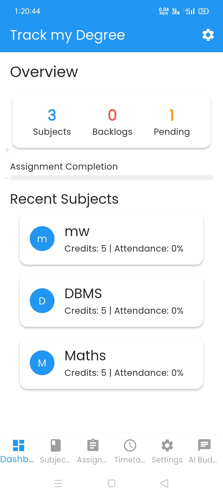
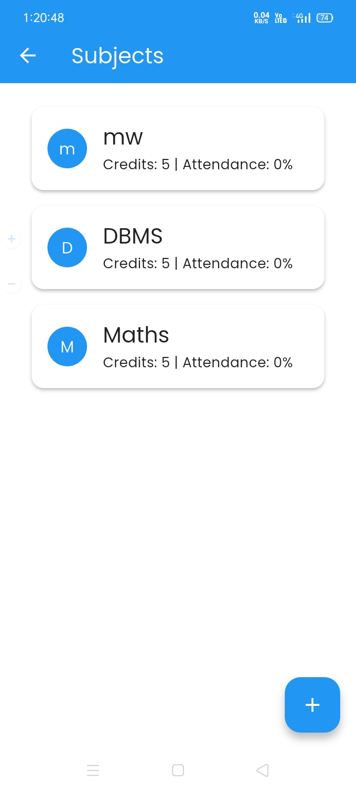
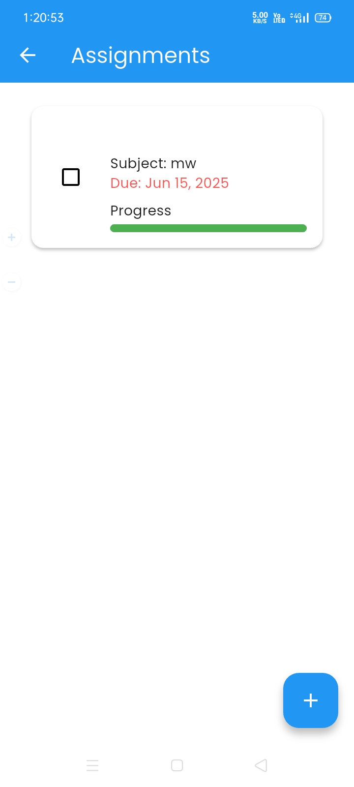
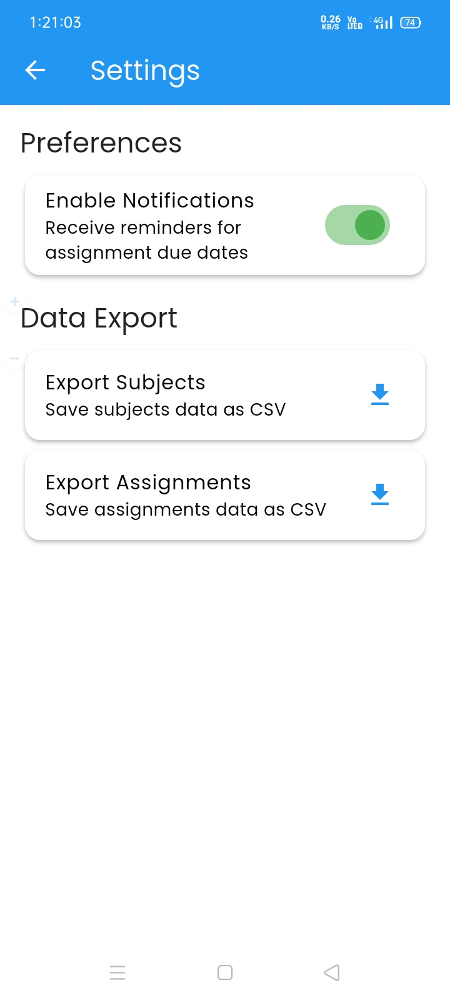

# 📘 Track My Degree

**Track My Degree** is a modern, Flutter-based mobile application developed to help college students manage and streamline their academic life. From subjects and assignments to timetables and backlogs, everything is neatly organized in one place with a clean, responsive, and user-friendly interface.

---

## 🔽 Download

Grab the latest build of **Track My Degree**:

👉 [Download APK (v1.0.0)](https://drive.google.com/file/d/1ThiNW3wqG1CaLjMH-ZQEGlXA2l86DKzO/view?usp=sharing)

---

## ✨ Features

- **📊 Dashboard**: View academic stats and recent subjects at a glance.
- **📚 Subjects**: Track attendance, credits, marks, and backlog status.
- **📝 Assignments**: Create, track, and complete assignments with reminders.
- **📅 Timetable**: Organize your weekly schedule.
- **⚙️ Settings**:
  - Toggle reminders
  - Export data to CSV
  - Switch themes (Light/Dark)
- **📦 Data Export**: Save subject and assignment data offline.
- **🌙 Theming**: Light & Dark mode support.
- **📱 Cross-Platform**: Works on Android & iOS.
- **🎨 Custom Branding**: Splash screen and app icon with a modern academic design.

---

## 📸 Screenshots

| Dashboard                                      | Subjects                                     | Assignments                                        | Settings                                     |
| ---------------------------------------------- | -------------------------------------------- | -------------------------------------------------- | -------------------------------------------- |
|  |  |  |  |

---

## 🧠 Architecture

### 📂 Data Layer

- **SQLite** via `sqflite` for persistent local storage
- Tables: `subjects`, `assignments`, `timetable`
- Managed by `DbService` (`services/db_service.dart`)

### 🧩 Models

- `Subject`: ID, name, credits, isBacklog, attendance, marks
- `Assignment`: ID, subjectId, title, dueDate, isCompleted
- `TimetableEntry`: ID, subjectId, day, startTime, endTime

### 🧠 State Management

- Powered by `flutter_riverpod`
- Providers: `subjectProvider`, `assignmentProvider`, `timetableProvider`, `themeProvider`, `notificationsEnabledProvider`

### 🎨 UI/UX

- Reusable widgets: `SubjectCard`, `AssignmentTile`, `ProgressBar`
- Themes: Defined in `core/theme.dart` with Poppins font, blue/green pastel palette
- Transitions: `flutter_animate` for smooth animations

### 🔧 Services

- **DbService** – SQLite CRUD operations
- **NotificationService** – Local alerts via `flutter_local_notifications`
- **DataExportService** – Export to CSV using `csv` and `path_provider`
- **Permissions** – Handled with `permission_handler`

---

## 🧰 Tech Stack

| Category         | Technology Used                               |
| ---------------- | --------------------------------------------- |
| Framework        | Flutter (Dart)                                |
| State Management | flutter_riverpod                              |
| Local Storage    | sqflite                                       |
| Notifications    | flutter_local_notifications, timezone         |
| File Handling    | path_provider, csv                            |
| Fonts            | google_fonts (Poppins)                        |
| Animations       | flutter_animate                               |
| Date Formatting  | intl                                          |
| Charts           | fl_chart                                      |
| Unique IDs       | uuid                                          |
| Permissions      | permission_handler                            |
| Branding         | flutter_launcher_icons, flutter_native_splash |
